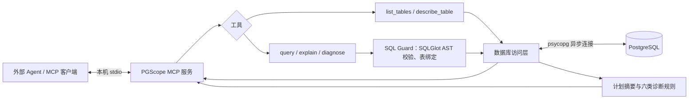

# PGScope MCP 架构与边界

PGScope MCP 是供外部 Agent 调用的本地 PostgreSQL 只读工具服务，本身没有 LLM、提示词推理或自主执行索引的组件。服务端持有连接配置，并通过官方 MCP SDK 的 stdio 接口暴露五个工具。

`list_tables` 分页列出授权 schema 中可读的普通业务表；`describe_table` 返回字段、约束和索引元数据，不读取样本行。`query` 执行受限的单条 SELECT，默认最多 100 行，上限 1000 行和 1 MiB JSON。`explain` 返回 PostgreSQL JSON 计划及逐节点摘要；`diagnose` 结合 SQL AST、实际表索引与计划输出带证据的建议。候选 `CREATE INDEX` 仅作为文本返回，从不由服务端执行。

## 只读防线

1. **SQL Guard**：只接受受支持的单条 SELECT；按精确 AST 类型限制语法和函数，拒绝写操作、多语句、系统 schema 及不能确定作用域的表引用。真实表按允许的 schema 绑定并限定名称，CTE 不当作真实表。函数白名单是兼容范围，不是对不可信数据库对象的沙箱。
2. **数据库事务**：每次调用使用独立连接和只读事务；服务端固定 `search_path=pg_catalog`，限制连接、语句与锁等待时间，检查当前角色不是超级用户等管理员角色，并核对被访问的普通表。调用完成或取消时关闭连接并回滚。`EXPLAIN ANALYZE` 会真正执行 SELECT，默认禁用，须由服务端配置开放。
3. **数据库账号**：部署时使用仅授予业务表 SELECT 的独立只读账号；演示账号没有 CREATE、TEMP 或管理权限。它是最终权限边界，不能用管理员 DSN 代替。

在 Windows 上，入口采用 `SelectorEventLoop`，以兼容 psycopg 的异步套接字接口；客户端取消仍走连接上下文的清理路径。服务端最多并发处理四个数据库操作。只支持已授权、可信数据库中的普通业务表；不承诺隔离恶意扩展、自定义函数或 DBA。

## 计划与诊断口径

计划摘要保留每个节点在原始 JSON 中的路径，例如 `$.Plan.Plans[0]`。`estimated_cost` 是 PostgreSQL 规划器的相对成本单位，**不是毫秒**；`planning_time_ms`、`execution_time_ms` 只有实测计划提供时才是时间。父节点指标包含子树影响，不能把父子成本、耗时或 buffers 简单相加。`Actual Rows` 是每次循环的平均行数，行数偏差诊断与同口径的 `Plan Rows` 比较，并单独保留 `Actual Loops`；上层 `Limit`、`EXISTS`、半连接等可能提前停止扫描时，保守跳过此诊断。

六类规则覆盖 `SELECT *`、无条件笛卡尔积、估算高度选择性的大表顺序扫描、已有索引列上的函数或类型转换、实测与估算行数相差至少十倍、实测磁盘排序。无 `ANALYZE` 时不会推断实测行数偏差或排序落盘；缺少表统计信息时不会猜测选择性。索引 DDL 只在顶层直接读取真实单表、过滤列存在且没有可用普通前导列索引时给出；CTE、派生表、多表连接和嵌套查询不生成候选 DDL，以免把输出别名误当作真实列。建议仍需人工审查写入成本与业务负载。

## 数据与隐私边界

stdio 使服务端无需监听网络端口，但调用工具的 Agent 会收到所请求的行、表结构、SQL、计划或诊断证据；客户端如何保存或上传这些内容由客户端控制。生产环境应只授权必要 schema、表与账号，并避免在 SQL 字面量中放入秘密。服务端将 DSN 作为私有配置，不通过工具参数传入；错误边界返回脱敏消息，日志不打印原始 SQL、值或凭据。本服务没有对外部 Agent 的数据使用方式作保证。
